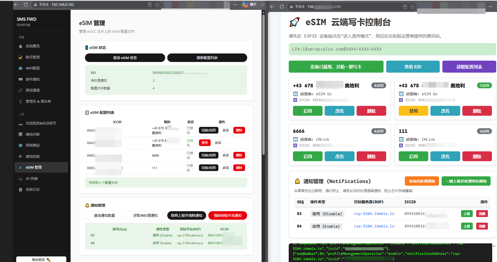
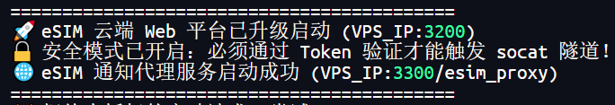
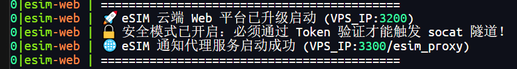

## 本项目是配套工具，补充远程写卡，VPS需要root权限

https://github.com/Q303835/sms_forwarding
### 通过lpac对esp32c3+ML307R DC 的esim卡进行操作。



# docker 部署，要root用户

## 拉取镜像
```bash
docker pull q303835/esim-web:latest
```

## 启动docker 容器
``` bash
docker run -d \
  --name esim-web \
  --restart unless-stopped \
  --privileged \
  -p 3100:3100 \
  -p 3200:3200 \
  -p 3300:3300 \
  -e API_TOKEN="your_secure_token_here" \
  q303835/esim-web:latest
```


## docker-compose.yml配置

``` yaml
services:
  esim-web:
    image: q303835/esim-web:latest
    container_name: esim-web
    restart: unless-stopped
    privileged: true
    ports:
      - "3100:3100"   # 透传隧道端口
      - "3200:3200"   # Web 管理后台端口
      - "3300:3300"   # 独立通知上报代理端口
    environment:
      - API_TOKEN=esim123        # 【必改】请修改为你的安全密钥
      - WEB_PORT=3200
      - TUNNEL_PORT=3100
      - PROXY_PORT=3300
```

## 查看日志

`docker logs -t esim-web`
## 看见这个就是启动成功


#### 在 本地ESP32 网页【LPA Passthrough】填：IP:3100

#### 写卡平台，用浏览器打开：http://ip:3200

####  ESP32 切卡，删除等，通知转发【自建代理地址】填：http://ip:3300/esim_proxy


---


# vps部署（需要root权限）

安装
``` bash
apt update && apt install -y libpcsclite1 pcscd socat libcurl4
```
nodejs安装
> curl -fsSL https://deb.nodesource.com/setup_22.x | sudo -E bash -
> apt-get install -y nodejs

安装pm2


``` bash
npm install -g pm2
```

部署使用
``` bash
git clone https://github.com/Q303835/esim-web.git 

cd esim-web

API_TOKEN="你的复杂密码" WEB_PORT=3200 TUNNEL_PORT=3100 PROXY_PORT=3300 pm2 start server.js --name "esim-web"
```

## 查看日志
`pm2 logs esim-web`



- 在 ESP32 网页【LPA Passthrough】填：IP:3100

- 写卡平台，用浏览器打开：http://ip:3200

- ESP32 切卡，删除等，通知转发【自建代理地址】填：http://ip:3300/esim_proxy


